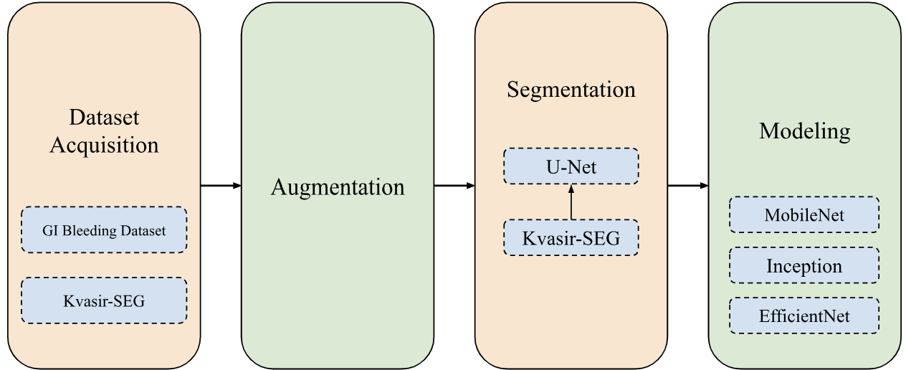

# Feature-extraction-with-Semantic-Segmentation-and-TL-for-AD

## Abstract
Wireless Capsule Endoscopy (WCE) is an imaging tool for capturing images of the gastrointestinal (GI) tract, facilitating the diagnosis of abnormalities such as lesions and bleeding. However, the analysis of these images is time-consuming for medical professionals. This study addresses the challenges of automated lesion detection in WCE images by utilizing a combination of data augmentation, segmentation, and transfer learning techniques. Semantic segmentation is employed with the U-Net architecture and transfer learning is applied using pre-trained models such as MobileNet, InceptionV3, and EfficientNet for classification tasks. Our results demonstrate that the use of segmented images significantly enhances classification accuracy, than those without, achieving the accuracy of 75\% using MobileNet. This research highlights the potential of deep learning techniques to improve the efficiency of medical image analysis in WCE applications.


## Motivation
Delayed hemorrhage in trauma patients significantly impacts multiple body systems, making it a critical factor in patient outcomes. Lesions found in the abdominal cavity cause hemorrhage which is one of the leading cause of trauma-related deaths, underscoring its severity in emergency medical scenarios. Annually, it affects between 80 to 150 per 100,000 people, highlighting its prevalence. Despite advances in trauma care and intervention strategies, the mortality rates associated with hemorrhage are still concerning, ranging from 2 to 15 percent. This variability in mortality rates can be attributed to factors such as the severity and location of the injury, the timeliness and effectiveness of medical intervention, and the overall health and resilience of the patient. The complex interplay between rapid blood loss and the body's compensatory mechanisms can lead to complications affecting not just the digestive system, but also cardiovascular, respiratory, and renal systems, among others. Hence, there needs to be a prompt and efficient management framework to improve survival rates.


## Approach


Here, a novel method for abnormality detection in capsule endoscopy frames is proposed. To include noise, distortions, blurriness, etc., to the images, and also to increase the image dataset size, augmentation is applied to each image. The next phase is the segmentation phase, where segmented masks are developed for each image. Transfer Learning is applied to the segmented images' dataset, to extract features and find patterns within an image that identifies an image with a lesion. The structure can be comprehended with the flowchart above.


## Project Organization

```
├── Data Augmentation/    # Script for executing the augmentation procedure of the images
├── Data/  # Contains the original images, augmented images, and the segmented images, split according to the training and testing usage 
├── Modeling/     # Contain related data and python notebooks that were utlized for Transfer Learning and comparative analysis
├── Segmentation/  # Contains related data and python scripts for segmentation of images with fine-tuned U-Net
```


## Detailed research report
More can be found out on the preprint paper published on ResearchGate. Link:- https://www.researchgate.net/publication/381233058_Feature_Extraction_for_Lesion_Detection_using_Semantic_Segmentation_and_Transfer_Learning
